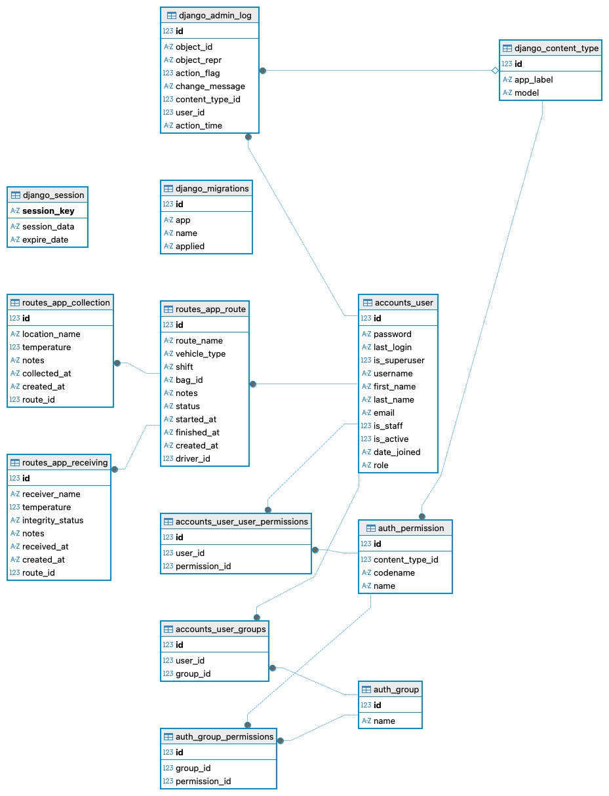

# TRACE-LAB

Sistema de rastreabilidade para transporte de amostras biológicas, com backend em Django REST Framework e aplicativo móvel em Flutter.

O projeto implementa um fluxo operacional enxuto e orientado por perfis:

- `Motorista`: inicia rotas, registra coletas e finaliza o transporte.
- `Recebedor`: visualiza rotas finalizadas e registra o recebimento.
- `Administrador`: possui acesso a uma área administrativa inicial.

## Visão Geral

O TRACE-LAB foi estruturado para apoiar a rastreabilidade de amostras durante o deslocamento entre pontos de coleta e o laboratório. O sistema registra dados essenciais do transporte, como rota, veículo, turno, bolsa de transporte, temperaturas e observações operacionais.

Na versão atual, o escopo implementado está concentrado no processo de transporte e recebimento. Funcionalidades laboratoriais mais amplas, como cadastro de pacientes, exames, laudos e resultados, não foram identificadas no código-fonte analisado.

## Arquitetura

```text
Usuário
  -> Aplicativo Flutter
    -> API REST (Django REST Framework)
      -> Regras de acesso por perfil
        -> Banco SQLite
```

### Backend

- `backend/accounts`: autenticação JWT e modelo de usuário com papéis.
- `backend/routes_app`: rotas de transporte, coletas e recebimentos.
- `backend/config`: configuração do projeto Django, apps instaladas e CORS.

### Frontend

- `mobile/lib/features/auth`: login e direcionamento por perfil.
- `mobile/lib/features/start_route`: abertura de rota.
- `mobile/lib/features/active_route`: acompanhamento da rota e finalização.
- `mobile/lib/features/collection`: registro de coleta.
- `mobile/lib/features/receiver` e `mobile/lib/features/receiving`: fila de recebimento e confirmação de recebimento.
- `mobile/lib/features/route_summary`: resumo final da rota para o motorista.

## Funcionalidades Implementadas

### Autenticação

- Login com `username` e `password`
- Emissão de token JWT
- Resolução de tela inicial conforme o papel do usuário

### Fluxo do Motorista

- Início de rota com nome, tipo de veículo, turno e bolsa
- Registro de coletas com local, temperatura e observações
- Consulta da linha do tempo de coletas
- Finalização da rota com atualização de status
- Visualização de resumo operacional após o encerramento

### Fluxo do Recebedor

- Listagem de rotas finalizadas pendentes de recebimento
- Registro de nome do recebedor
- Registro de temperatura de recebimento
- Registro da integridade das amostras
- Confirmação do recebimento com retorno ao fluxo de recebimento

### Administração

- Dashboard administrativo inicial

## Modelo de Dados

Principais entidades identificadas:

- `accounts_user`: usuários com papel `driver`, `receiver` ou `admin`
- `routes_app_route`: dados principais da rota
- `routes_app_collection`: eventos de coleta vinculados à rota
- `routes_app_receiving`: recebimento final da rota

O MER analisado mostra uma relação:

- `User 1:N Route`
- `Route 1:N Collection`
- `Route 1:1 Receiving`



## API REST

Principais endpoints identificados:

- `POST /api/auth/login/`
- `POST /api/auth/refresh/`
- `POST /api/routes/`
- `GET /api/routes/<id>/`
- `GET /api/routes/<id>/collections/`
- `POST /api/routes/<id>/collections/`
- `POST /api/routes/<id>/finish/`
- `POST /api/routes/<id>/receiving/`
- `GET /api/routes/pending-receiving/`

## Tecnologias Confirmadas no Projeto

| Tecnologia | Finalidade | Evidência |
|---|---|---|
| Django | Estrutura do backend | `backend/config/settings.py` |
| Django REST Framework | Exposição da API REST | `backend/config/settings.py` |
| Simple JWT | Autenticação JWT | `backend/accounts/views.py` |
| Flutter | Aplicação móvel multiplataforma | `mobile/pubspec.yaml` |
| package `http` | Consumo da API no app Flutter | `mobile/pubspec.yaml` |
| SQLite | Banco de dados atual | `backend/config/settings.py` |
| CORS Headers | Liberação de acesso local ao frontend | `backend/config/settings.py` |
| GitHub | Hospedagem de código | remoto `origin` |

## Estrutura do Repositório

```text
trace-lab/
├── backend/
│   ├── accounts/
│   ├── config/
│   ├── core/
│   └── routes_app/
├── docs/
└── mobile/
    └── lib/
        └── features/
```

## Execução Local

### Backend

```bash
cd backend
python manage.py migrate
python manage.py runserver
```

### Mobile

```bash
cd mobile
flutter pub get
flutter run
```

O aplicativo está configurado para consumir a API em:

```text
http://127.0.0.1:8000/api
```

## Validação

Comandos recomendados pelo projeto:

```bash
cd mobile
flutter analyze
flutter test

cd ../backend
python manage.py check
python manage.py test
```

## Limitações Atuais Observadas

- Não há suíte de testes implementada de forma efetiva no backend.
- O teste padrão do Flutter ainda é um exemplo inicial e não reflete o produto.
- O dashboard administrativo está em estágio inicial.
- O escopo atual é focado no transporte e recebimento, não cobrindo todo o ciclo laboratorial.

## Documentação Complementar

- [Documentação técnica do projeto](docs/projeto_trace_lab.md)
- [Link do projeto](docs/link_projeto.txt)
- [Atividade acadêmica em Word](docs/atividade_ava.docx)
